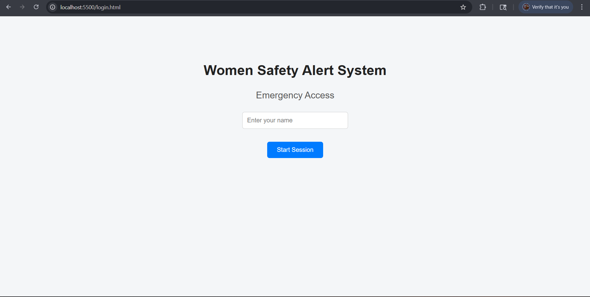
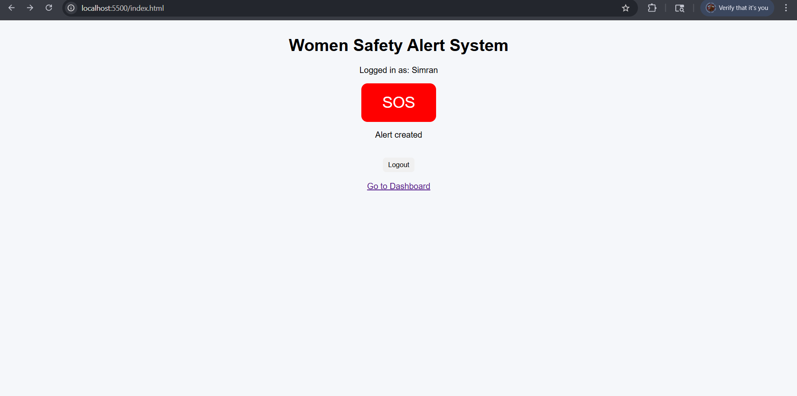
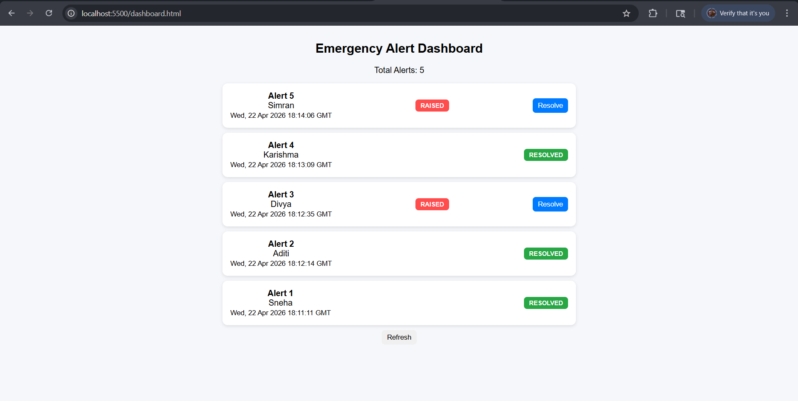
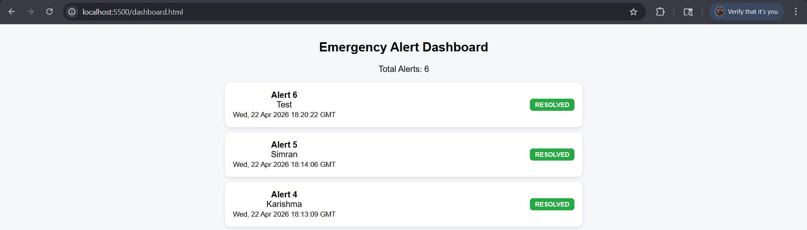
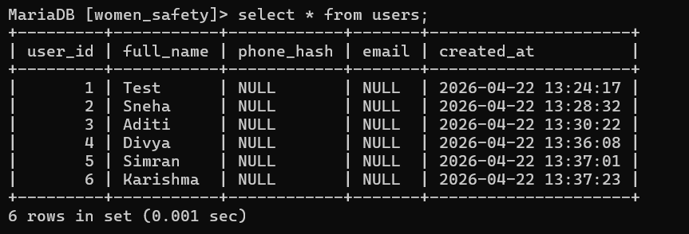
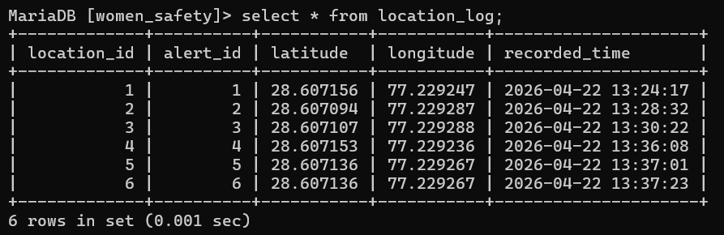

# Women Safety Alert System

## Overview

Women Safety Alert System is a DBMS-based emergency response application developed to provide fast and efficient emergency alert handling for women's safety. The system allows users to start a session, trigger SOS alerts, and store emergency and location data in real time using a relational database structure.

The project focuses on:
- Real-time emergency response
- Database normalization
- Foreign key relationships
- Privacy-aware data handling

---

## Features

- Session-based user identification
- SOS emergency alert system
- Real-time alert storage using MariaDB
- Dashboard for monitoring alerts
- Resolve alert functionality
- Auto-refreshing dashboard
- GPS location capture using browser Geolocation API
- Google Maps integration for alert locations
- Separate normalized location logging system
- User identity masking for privacy
- Restricted dashboard access
- Timestamped alerts

---

## Tech Stack

- Backend: Python (Flask)
- Database: MariaDB (MySQL)
- Frontend: HTML, CSS, JavaScript

---

## Project Structure

```text
Women-Safety-Alert-System/
│
├── backend/
│   ├── app.py
│   └── requirements.txt
│
├── frontend/
│   ├── login.html
│   ├── index.html
│   ├── dashboard.html
│   ├── script.js
│   └── style.css
│
├── screenshots/
│   ├── login.png
│   ├── sos.png
│   ├── dashboard.png
│   ├── resolved.png
│   ├── users_table.png
│   ├── alerts_table.png
│   ├── location_log_table.png
│   └── er_diagram.png
│
├── schema.sql
│
└── README.md
```

---

## Database Design

The application follows a relational database model with normalized entities.

## Tables Used

## Users

Stores user information.

## Emergency_Alerts

Stores alerts raised by users.

## Location_Log

Stores latitude and longitude linked to emergency alerts.

## Trusted_Contacts

Stores trusted emergency contacts for users.

## Authorities

Stores authority and station contact details.

---

## Relationships
- One user can raise multiple emergency alerts
- One emergency alert can contain multiple location logs
- One user can have multiple trusted contacts

---

## DBMS Concepts Used
- Relational Model
- Primary Keys
- Foreign Keys
- Data Integrity Constraints
- Normalization
- JOIN Operations
- SQL Queries (INSERT, SELECT, UPDATE)
- Transaction Handling

---

## How to Run

1. Install Dependencies
pip install -r backend/requirements.txt

2. Start Backend Server
python backend/app.py

3. Start Frontend Server
cd frontend
python -m http.server 5500

4. Open Application
http://localhost:5500/login.html

---

## System Workflow
1. User starts a session by entering their name
2. Session information is stored locally using localStorage
3. When SOS is triggered:
   - Browser captures current location using Geolocation API
   - Backend checks whether the user exists
   - Alert is inserted into Emergency_Alerts
   - Location is inserted into Location_Log
4. Dashboard retrieves alerts using JOIN queries
5. Alerts can be resolved from the dashboard

---

## Privacy Features
Minimal data collection
Event-based location tracking only
No continuous location monitoring
Masked user identity on dashboard
Restricted dashboard access for active sessions

---

## Key DBMS Concepts Used
- Relational Model
- Foreign Key Constraints
- Data Integrity
- Normalization (separating alerts and location logs)
- SQL Queries (JOIN, INSERT, UPDATE)
- Transaction Handling

---

## Screenshots

### Login Page


### SOS Page


### Dashboard


## Resolved Alert


## Users Table


## Emergency Alerts Table


## Location Log Table


---

## Future Enhancements
- Real authentication system (password-based login)
- Role-based access (admin/user)
- SMS or email notifications
- Live tracking with multiple location updates
- Map visualization using embedded maps

---

## Author
Rohit Gupta

---

## Note

This project is created for academic purposes and demonstrates core DBMS concepts including relational database design, normalization, foreign key relationships, and real-time data handling using a full-stack implementation.
